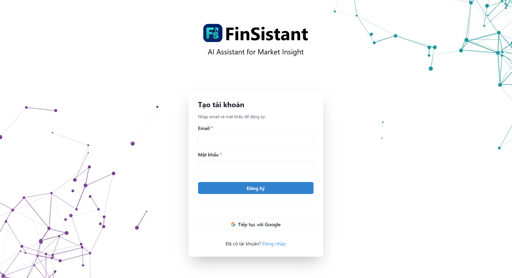

<div align="center">
  
  <h1>FinSistant: Building AI Agent for Summarizing Sector-wise Market News Impacting Stock Prices</h1>
</div>

**Vietnamese:** FinSistant: Xây dựng AI Agent tóm tắt tin tức thị trường theo ngành ảnh hưởng đến giá cổ phiếu  
**Abbreviation:** FinSistant (also referred to as **SPA – Stock Price Agent**)

> An automated AI Agent that **collects → summarizes → classifies by sector → analyzes sentiment → forecasts short-term trends**. Results are displayed on an intuitive dashboard.

[](#) [](#) [](#) [](#)
[](#) [](#) [](#license) [](#)

---

## 📖 Table of Contents

1.  [Project Overview](#1-project-overview)
2.  [Key Features](#2-key-features)
3.  [System Architecture](#3-system-architecture)
4.  [Data Pipeline](#4-data-pipeline)
5.  [Training ](#5-training)
6.  [AI Models & Tasks](#6-ai-models--tasks)
7.  [Installation & Deployment](#7-installation--deployment)
8.  [Usage Guide](#8-usage-guide)
9.  [Results & Demo](#9-results--demo)
10. [Team](#10-team)
11. [Acknowledgements](#11-acknowledgements)

---

## 1) Project Overview

- **Objective:** To automate the processing of financial news by **sector** and quantify its impact on **stock prices**, supporting faster and more informed investment decisions.

- **Problem:** The vast, noisy, and unstructured flow of market information makes manual monitoring and processing inefficient, often leading to delayed reactions and missed opportunities.

- **Solution:** A comprehensive AI-driven system that:
    -   Automatically **crawls** news from multiple reputable Vietnamese sources.
    -   **Summarizes** articles concisely using abstractive models (**ViT5**).
    -   **Classifies** news into sectors (Technology, Energy, Healthcare, Finance) and analyzes **sentiment** (Positive, Neutral, Negative) using **PhoBERT** and **XLM-Roberta**.
    -   **Forecasts** short-term stock price trends by integrating news sentiment with historical price data using **LSTM/GRU** models.
    -   Presents all analyzed information through an intuitive **web dashboard**.

**✅ Outcome:** A fully functional web system with an automated ETL + AI pipeline, a responsive dashboard, and near real-time data updates.

---

## 2) Key Features

-   **Automated News Aggregation:** Continuous crawling from multiple financial news sources.
-   **Intelligent Summarization:** Generates concise Vietnamese summaries focusing on key information using fine-tuned **ViT5**.
-   **Sector-Wise Classification:** Automatically categorizes news into **Technology, Energy, Healthcare, Finance**.
-   **Sentiment Analysis:** Classifies the tone of news articles as **Positive, Neutral, or Negative**.
-   **Price Trend Forecasting:** Provides short-term stock price forecasts using **LSTM/GRU** models enhanced with news sentiment features.
-   **Personalization:** Bookmark articles, manage watchlists, and receive customizable alerts.
-   **Admin Dashboard:** Manage news sources, crawling schedules, users, and monitor the AI pipeline health.

---

## 3) System Architecture

The system is designed with a modular, cloud-ready architecture for scalability and maintainability.

**🔧 Components:**

*   **Frontend (ReactJS):** Hosted on **Vercel**. Provides the user interface for dashboard, search, filtering, and visualization.
*   **Backend API (Python/Flask):** Hosted on **Hugging Face Spaces**. Handles business logic, user authentication, and serves processed data from the cache or database.
*   **AI & ETL Pipeline (Python):** Deployed on **DigitalOcean Droplets**. Responsible for:
    *   Data collection using **Selenium** and **BeautifulSoup**.
    *   Data preprocessing, normalization, and deduplication.
    *   Running AI models (Summarization, Classification, Sentiment).
    *   Feature engineering and storing results in the database.
*   **Data Layer:**
    *   **Supabase (PostgreSQL):** Primary persistent database for storing all processed news, stock prices, and user data.
    *   **Redis:** Serves as a high-performance cache layer to speed up API responses and queue background tasks.
*   **Orchestration:** **n8n** is used for workflow automation, such as refreshing cache data.

**🔁 Data Flow:**
1.  The ETL pipeline crawls and processes data, then stores it in Supabase.
2.  Processed data is loaded into Redis for fast access.
3.  User requests hit the Backend API, which first checks Redis (cache) for data.
4.  If data is not in cache (cache miss), the API fetches it from Supabase.
5.  The API returns structured data (JSON) to the Frontend for rendering.

*(Refer to **Figure 40: System Data Flow Diagram** in the project document for a detailed visualization)*

---
## 4) Data Pipeline

**📥 Data Sources:**
-   **News:** CafeF, PetroTimes, MarketTimes, Diễn đàn Doanh nghiệp, Chungta, IMEXPHARM.
-   **Stock Prices:** Simplize.

**⚙️ Preprocessing Steps:**
1.  **Collection:** Automated crawling using Selenium WebDriver and parsing with BeautifulSoup.
2.  **Validation & Deduplication:** Check for duplicates based on URL and content hash.
3.  **Cleaning:** Remove HTML tags, advertisements, footers, and special characters. Normalize Unicode (NFC) and whitespace.
4.  **Normalization:** Standardize text (lowercasing, diacritic handling where suitable).
5.  **Labeling:** Semi-automatic labeling for sector and sentiment using LLM suggestions followed by manual correction.
6.  **Integration:** Merge news data with stock price data based on timestamp and stock ticker.

---

## 5) Training

**📊 Datasets:**
-   **General News Dataset:** ~12,000 Vietnamese news records with `title`, `content`, `summary`, `industry`, and `sentiment` labels.
-   **Ticker-specific News:** Processed news mapped to specific stock tickers (FPT, GAS, VCB, IMP).
-   **Stock Price Data:** Daily OHLCV (Open, High, Low, Close, Volume) data.

---

## 6) AI Models & Tasks

| Task | Model | Description | Key Metric |
| :--- | :--- | :--- | :--- |
| **Text Summarization** | **VietAI/vit5-base** | Abstractive summarization of Vietnamese news articles. | BLEU Score: **0.2586** |
| **Sector Classification** | **PhoBERT-base** | Classifies news into 4 sectors: Technology, Energy, Healthcare, Finance. | Accuracy: **~90.6%**, F1-Score: **~0.906** |
| **Sentiment Analysis** | **PhoBERT-base** | Classifies news sentiment as Positive, Neutral, or Negative. |  Accuracy: **~83.5%**, F1-Score: **0.8216** |
| **Price Forecasting** | **LSTM/GRU Hybrid** | Predicts short-term stock price trends using historical prices and news sentiment counts. | Similarity: **0.98**, NMAE: **0.02** |

---


## 7) Installation & Deployment

### System Requirements
-   **OS:** Windows 10+, Ubuntu 20.04+, or macOS
-   **Backend:** Node.js v18+, npm v9+
-   **Frontend:** React.js, npm/yarn
-   **AI Pipeline:** Python +
-   **Database:** Supabase account, Redis instance
-   *(Optional)* **Docker:** Docker Desktop v4.0+

### Manual Installation
```bash
# 1. Clone the repository
git clone https://github.com/thanhdanh17/SPA-StockPriceAgent.git
cd SPA_AI

# 2. Install AI Pipeline dependencies
pip install -r requirements.txt

# 5. Run the applications

#  Start AI Pipeline 
python main.py


```
```

### Cloud Deployment (Current)
-   **Frontend:** Deployed automatically on **Vercel** on push to `main`.
-   **Backend API:** Deployed automatically on **Hugging Face Spaces**.
-   **AI Pipeline & Crawler:** Manually deployed on **DigitalOcean Droplets**.
-   **Database:** **Supabase** (PostgreSQL).
-   **Cache:** **Redis**.

---

## 8) Usage Guide

1.  **Access:** Navigate to the deployed frontend: [https://spa-fe-git-main-vietnh55s-projects.vercel.app/auth](https://spa-fe-git-main-vietnh55s-projects.vercel.app/auth)
2.  **Authenticate:** Register a new account or log in using your credentials.
3.  **Dashboard:** Upon login, you are directed to the main dashboard showing a unified news feed.
4.  **Filter News:** Use the sidebar filters to search by keyword, sector, stock ticker, date range, or sentiment.
5.  **View Details:** Click on any news article to view its AI-generated summary, sector classification, sentiment analysis, and a link to the original source.
6.  **Analysis Page:** Navigate to the "Analysis" section to view stock price charts and short-term trend forecasts for selected tickers (FPT, GAS, VCB, IMP).
7.  **Personalize:** Bookmark articles, add tickers/sectors to your watchlist, and configure alerts for impactful news.

*(For admin functions, please refer to the project documentation.)*

---

## 9) Results & Demo

### Live Demo
-   **Main Application Portal:** [https://spa-fe-git-main-vietnh55s-projects.vercel.app/auth](https://spa-fe-git-main-vietnh55s-projects.vercel.app/auth)


### Screenshots
| Dashboard  | Landing Page | News Detail |
| :---: | :---: | :---: |
|  | |  |

| Price Prediction |Bookmark | Personal notification |
| :---: | :---: |:---: |
|  |  | |


---

## 10) Team

| Role | Member | Responsibilities | Contact|
| :--- | :--- | :--- | :--- |
| **Project Manager & AI Engineer** | Bùi Đinh Thanh Danh (QE170016) | Overall project management, data pipeline architecture, time-series forecasting model development, deployment. | danhbdtqe170016@fpt.edu.vn |
| **AI Engineer** | Phạm Gia Thịnh (QE170177) | Data processing, industry classification and sentiment analysis model R&D, system testing. | thinhpgqe170177@fpt.edu.vn |
| **Full-stack & AI Engineer** | Nguyễn Hoàng Việt (QE170216) | News summarization model R&D, frontend development, system integration, UI/UX optimization. | vietnhqe170216@fpt.edu.vn |
| **AI Engineer** | Chế Minh Quang (QE170206) | Data processing, improvement and optimization of all AI modules (classification, sentiment, summarization). | quangcmqe170206@fpt.edu.vn |

**Supervisors:**
-   **Nguyễn Thị Cẩm Hương** (Main Supervisor)
-   **Nguyễn Văn Vịnh** (External Supervisor)

**Institution:** FPT University, Quy Nhon Campus.

---

## 11) Acknowledgements

We extend our sincere gratitude to:
-   Our supervisors, **Ms. Nguyễn Thị Cẩm Hương** and **Mr. Nguyễn Văn Vịnh**, for their dedicated guidance and support throughout this project.
-   **FPT University** for providing the facilities and environment for our research.
-   The providers of the data and tools that made this project possible:
    -   **Financial News Sources:** CafeF, PetroTimes, MarketTimes, Diễn đàn Doanh nghiệp, Chungta, IMEXPHARM.
    -   **Financial Data API:** Simplize.
    -   **Open-Source Libraries & Frameworks:** Selenium, BeautifulSoup, Hugging Face Transformers, PyTorch, TensorFlow, scikit-learn, pandas, NumPy, Flask, React, Supabase, Redis.

---


*This project is part of a graduation project of a group of students at FPT University. For more details, please refer to the full project documents.*
