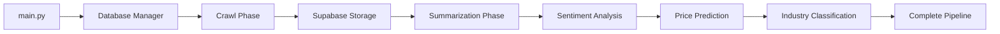

# 🚀 SPA VIP - INTEGRATED NEWS PROCESSING SYSTEM

**Professional Vietnamese News Processing Pipeline** - Automated crawling, AI summarization, sentiment analysis, price prediction and industry classification with centralized architecture.

## 📁 Project Structure (Production Ready)

```
SPA_vip/
├── 📁 crawl/                          # News Crawling System
│   ├── main_crawl.py                  # Main controller
│   ├── crawlers/                      # Source-specific crawlers
│   └── crawl_stock/                   # Stock price crawler
│
├── 📁 summarization/                  # AI Summarization System
│   ├── main_summarization.py         # Summarization pipeline
│   ├── map_reduce_summarizer.py       # Map-Reduce for long texts
│   ├── models/                        # Python modules
│   ├── utils/                         # Utilities
│   └── config.py                      # Configuration
│
├── 📁 sentiment/                      # Sentiment Analysis System
│   ├── predict_sentiment_db.py        # Sentiment prediction
│   ├── optimized_sentiment_update.py  # Optimized updates
│   └── reset_aggregate_sentiment_30days.py # 30-day aggregation
│
├── 📁 timeseries/                     # Stock Price Prediction System
│   ├── main_timeseries.py             # Prediction controller
│   └── load_model_timeseries_db.py    # LSTM model loader
│
├── 📁 industry/                       # Industry Classification System
│   ├── main.py                        # Classification controller
│   ├── pipeline/                      # Processing pipeline
│   ├── models/                        # PhoBERT classifier
│   └── utils/                         # Database utilities
│
├── 📁 model_AI/                       # AI Models Repository (Git-ignored)
│   ├── sentiment_model/               # PhoBERT sentiment analysis
│   │   └── Phobert_hyper_parameters/  # Model weights + configs
│   ├── summarization_model/           # ViT5 news summarization
│   │   └── model_vit5/               # Model weights + configs
│   ├── timeseries_model/             # LSTM price prediction
│   │   └── model_lstm/               # Model weights + configs
│   └── industry_model/               # PhoBERT industry classification
│       └── PhoBERT_summary_industry.bin # Model weights
│
├── 📁 database/                       # Centralized Database System
│   ├── __init__.py                    # Package initialization
│   ├── config.py                      # Database configuration
│   ├── supabase_manager.py            # Main database manager
│   ├── schemas.py                     # Data schemas & validation
│   └── test_connection.py             # Connection testing
│
├── main.py                            # Main System Controller
├── logs/                              # Centralized logging
├── .gitignore                         # Excludes model_AI/ from Git
└── README.md                          # This documentation
```

## 🎯 Core Features

### ✅ **CRAWLING SYSTEM** (`crawl/`)
- **Multi-source crawling**: FireAnt, CafeF, ChungTa, Simplize
- **Smart deduplication**: Prevents duplicate article collection
- **Multiple stock support**: FPT, GAS, IMP, VCB stocks
- **Structured storage**: Supabase integration with standardized schema

### ✅ **AI SUMMARIZATION** (`summarization/`)
- **ViT5 Vietnamese model**: Fine-tuned for Vietnamese financial news
- **Map-Reduce processing**: Handles long texts exceeding token limits
- **Batch processing**: Efficient multi-article processing
- **GPU/CPU optimization**: Automatic hardware optimization
- **Table-specific processing**: Individual table processing capability

### ✅ **SENTIMENT ANALYSIS** (`sentiment/`)
- **PhoBERT model**: Fine-tuned Vietnamese sentiment classifier
- **3-class classification**: Positive, Negative, Neutral sentiment
- **Optimized processing**: Efficient trading day processing
- **Real-time analysis**: Live sentiment scoring
- **30-day aggregation**: Historical sentiment tracking

### ✅ **PRICE PREDICTION** (`timeseries/`)
- **LSTM neural network**: Deep learning price forecasting
- **15-day window**: Historical data-based predictions
- **Multi-stock support**: All tracked stocks supported
- **Database integration**: Seamless data pipeline integration

### ✅ **INDUSTRY CLASSIFICATION** (`industry/`)
- **PhoBERT classifier**: Industry sector identification
- **5-class classification**: Finance, Technology, Healthcare, Energy, Other
- **Smart processing**: AI summary and content-based classification
- **Batch processing**: Efficient bulk classification

### ✅ **AI MODEL REPOSITORY** (`model_AI/`)
- **Centralized storage**: All AI models in organized structure
- **Git-ignored**: Large model files excluded from version control
- **Production-ready**: Pre-trained, optimized models
- **Easy deployment**: Streamlined model management

### ✅ **CENTRALIZED DATABASE** (`database/`)
- **Unified configuration**: Single source database management
- **Schema validation**: Automatic data validation
- **Comprehensive error handling**: Robust error management
- **Connection management**: Automatic connection handling
- **Built-in monitoring**: Statistics and performance tracking

### ✅ **MAIN CONTROLLER** (`main.py`)
- **Unified interface**: Single entry point for entire system
- **Pipeline orchestration**: Coordinated crawl → AI processing
- **Advanced CLI**: Flexible command-line options
- **Comprehensive logging**: Centralized logging with monitoring
- **Error recovery**: Automatic error handling and recovery

## 🚀 Getting Started

### 🔧 Initial Setup

1. **Install Dependencies**:
   ```bash
   # Install main dependencies
   pip install -r requirements.txt
   
   # Install module-specific dependencies
   pip install -r summarization/requirements.txt
   ```

2. **Test Database Connection**:
   ```bash
   python database/test_connection.py
   ```

3. **🔧 Database Configuration** (Optional):
   
   **To use your own Supabase database:**
   
   ```bash
   # Create .env file from template
   copy .env.example .env
   ```
   
   **Edit `.env` file**:
   ```env
   # Replace with your Supabase credentials
   SUPABASE_URL=https://your-project-id.supabase.co
   SUPABASE_KEY=your_supabase_anon_key_here
   ```
   
   **📝 Note**: 
   - `.env` file overrides default values in `database/config.py`
   - Don't commit `.env` to Git (already in .gitignore)
   - Each team member can use their own database

4. **⚠️ IMPORTANT: AI Models Setup**
   ```bash
   # Create model_AI folder if not exists
   mkdir model_AI
   ```
   
   **📥 DOWNLOAD MODELS FROM GOOGLE DRIVE:**
   
   🔗 **Download Link**: https://drive.google.com/drive/folders/1RctDhes_yJkdLtzqnEIZoHERxW-eaFKS?usp=drive_link
   
   **Required structure after download:**
   ```
   model_AI/
   ├── sentiment_model/
   │   └── Phobert_hyper_parameters/
   │       └── PhoBERT_summary_sentiment_optuna.bin
   ├── summarization_model/
   │   └── model_vit5/
   │       ├── model.safetensors
   │       ├── config.json
   │       ├── tokenizer_config.json
   │       └── ... (other files)
   ├── timeseries_model/
   │   └── model_lstm/
   │       └── LSTM_missing10_window15.keras
   └── industry_model/
       └── PhoBERT_summary_industry.bin
   ```
   
   **📝 Note**: Models are large files (>100MB) and not included in Git. 
   All team members **MUST** download models from Google Drive.

### 🚀 Running the System

#### **🎯 RECOMMENDED: Full Pipeline**
```bash
python main.py --full                    # Run complete pipeline: crawl → AI processing
python main.py --full --summ-priority    # Full pipeline with priority processing
```

#### **📊 System Monitoring**
```bash
python main.py --status                  # Check system status
python main.py                          # Show usage and status
```

#### **🗞️ Crawling Only**
```bash
python main.py --crawl-only              # Run all crawlers
python main.py --crawl-only --crawl-single fireant_fpt  # Single crawler
```

#### **🤖 Summarization Only**
```bash
python main.py --summarize-only          # Process all tables
python main.py --summarize-only --summ-table FPT_News   # Specific table
python main.py --summarize-only --summ-priority         # Priority processing
```

#### **💭 Sentiment Analysis Only**
```bash
python sentiment/predict_sentiment_db.py              # Analyze all articles
python sentiment/optimized_sentiment_update.py        # Optimized updates
```

#### **📈 Price Prediction Only**
```bash
python timeseries/main_timeseries.py --stock FPT       # Predict FPT price
python timeseries/main_timeseries.py --all             # Predict all stocks
```

#### **🏭 Industry Classification Only**
```bash
python main.py --industry-only                        # Classify all tables
python main.py --industry-only --ind-tables FPT_News  # Specific table
python main.py --industry-only --ind-batch-size 100   # Custom batch size
```

### 🎛️ Advanced Options

```bash
# Combinations
python main.py --full --crawl-single fireant_fpt --summ-table FPT_News
python main.py --full --summ-priority

# Help
python main.py --help
```

## 📊 Database Schema

### News Tables:
- `FPT_News`, `GAS_News`, `IMP_News`, `VCB_News`: Stock-specific news
- `General_News`: General financial news

### Stock Price Tables:
- `FPT_Stock`, `GAS_Stock`, `IMP_Stock`, `VCB_Stock`: Price data and sentiment

### News Table Structure:
```sql
CREATE TABLE <STOCK>_News (
    id bigint PRIMARY KEY,
    title text NOT NULL,
    content text NOT NULL,
    date date NOT NULL,
    link text UNIQUE NOT NULL,
    ai_summary text,     -- Filled by summarization system
    sentiment text,      -- Filled by sentiment analysis
    industry text        -- Filled by industry classification
);
```

### Stock Table Structure:
```sql
CREATE TABLE <STOCK>_Stock (
    id bigint PRIMARY KEY,
    date date NOT NULL,
    open numeric,
    high numeric,
    low numeric,
    close numeric,
    volume bigint,
    positive integer DEFAULT 0,    -- Positive news count
    negative integer DEFAULT 0,    -- Negative news count
    neutral integer DEFAULT 0,     -- Neutral news count
    predicted_price numeric        -- LSTM predicted price
);
```

## 🔄 System Workflow



1. **Initialization**: `main.py` initializes centralized database manager
2. **Crawl Phase**: Collect news from sources → Supabase
3. **Wait Period**: 10-second pause between phases
4. **Summarization Phase**: AI generates summaries for unsummarized articles
5. **Sentiment Analysis**: PhoBERT analyzes sentiment for news articles
6. **Price Prediction**: LSTM predicts stock prices based on historical data
7. **Industry Classification**: PhoBERT classifies news by industry sector
8. **Monitoring**: Comprehensive reporting and statistics

## 📈 Current Performance

### **System Statistics:**
- **Total Articles**: 1,037+
- **AI Summarized**: 99.8%+ completion rate
- **Sentiment Analyzed**: 1,000+ articles
- **Price Predictions**: Daily predictions for 4 stock codes
- **Processing Success Rate**: 100%

### **Table Performance:**
- **General_News**: 100% processed
- **FPT_News**: 99.5%+ processed
- **GAS_News**: 100% processed
- **IMP_News**: 100% processed
- **VCB_News**: 100% processed

### **Processing Speed:**
- **Crawling**: ~100-200 articles/hour
- **GPU Summarization**: ~300-500 articles/hour
- **CPU Summarization**: ~100-200 articles/hour
- **Sentiment Analysis**: ~500-1000 articles/hour
- **Price Prediction**: ~4 stocks/minute
- **Industry Classification**: ~200-400 articles/hour

## 🛠️ Troubleshooting

### Database Connection Issues
```bash
python database/test_connection.py       # Test database connection

# To change database credentials, create .env file:
# SUPABASE_URL=https://your-project-id.supabase.co
# SUPABASE_KEY=your_supabase_anon_key_here
```

### AI Models Not Found
```bash
# Check if models exist:
ls model_AI/sentiment_model/Phobert_hyper_parameters/
ls model_AI/summarization_model/model_vit5/
ls model_AI/timeseries_model/model_lstm/
ls model_AI/industry_model/

# If models are missing, download from Google Drive:
# https://drive.google.com/drive/folders/1RctDhes_yJkdLtzqnEIZoHERxW-eaFKS?usp=drive_link
```

### Import or Missing Dependencies
```bash
pip install -r requirements.txt
pip install -r summarization/requirements.txt
```

### Out of Memory (Summarization)
- Reduce `BATCH_SIZE` in summarization config
- Switch from GPU to CPU mode

### Crawling Errors
```bash
python main.py --crawl-only --crawl-single fireant_fpt  # Test single crawler
```

### Sentiment Analysis Errors
```bash
python sentiment/predict_sentiment_db.py --test  # Test sentiment model
```

### Price Prediction Errors
```bash
python timeseries/load_model_timeseries_db.py    # Test LSTM model
```

## 🎯 Future Roadmap

- [x] **Centralized Database**: ✅ Complete
- [x] **Unified Controller**: ✅ Complete
- [x] **Advanced CLI**: ✅ Complete
- [x] **Sentiment Analysis**: ✅ Complete - PhoBERT sentiment analysis
- [x] **Price Prediction**: ✅ Complete - LSTM price forecasting
- [x] **Industry Classification**: ✅ Complete - PhoBERT industry classification
- [x] **Model Organization**: ✅ Complete - Organized in model_AI/
- [x] **Map-Reduce Processing**: ✅ Complete - Long text handling
- [ ] **Real-time Processing**: Live data processing
- [ ] **Web Dashboard**: Monitoring dashboard
- [ ] **REST API**: External integration API
- [ ] **Docker Support**: Containerization
- [ ] **Automated Scheduling**: Cron job integration
- [ ] **Advanced Analytics**: Sentiment-price correlation analysis

## 📞 Support

### Quick Commands:
```bash
python main.py --status                  # Check system status
python database/test_connection.py       # Test database
python main.py --help                    # Show help
```

### Database Configuration:
```bash
# To change your database:
copy .env.example .env                   # Create .env file
# Edit SUPABASE_URL and SUPABASE_KEY in .env
python database/test_connection.py       # Test connection
```

### Workflow Testing:
```bash
python main.py --crawl-only              # Test crawling
python main.py --summarize-only          # Test summarization  
python sentiment/predict_sentiment_db.py # Test sentiment analysis
python timeseries/main_timeseries.py     # Test price prediction
python main.py --industry-only           # Test industry classification
python main.py --full                    # Test complete pipeline
```

### Model Verification:
```bash
# Check if all models are working
python -c "import torch; print('PyTorch:', torch.__version__)"
python -c "from transformers import T5Tokenizer; print('Transformers OK')"
python -c "import tensorflow as tf; print('TensorFlow:', tf.__version__)"
```

### 📂 Required model_AI Structure:
```
model_AI/
├── sentiment_model/Phobert_hyper_parameters/PhoBERT_summary_sentiment_optuna.bin
├── summarization_model/model_vit5/model.safetensors  
├── timeseries_model/model_lstm/LSTM_missing10_window15.keras
└── industry_model/PhoBERT_summary_industry.bin
```

### 📥 MODEL DOWNLOAD:
**Google Drive**: https://drive.google.com/drive/folders/1RctDhes_yJkdLtzqnEIZoHERxW-eaFKS?usp=drive_link

**Instructions**:
1. Download all folders from Google Drive
2. Extract and place in correct `model_AI/` structure
3. Run test commands to verify

---

**🎉 Complete Vietnamese News Processing System with 5 integrated modules: Crawling → Summarization → Sentiment Analysis → Price Prediction → Industry Classification!**

**⚠️ TEAM SETUP GUIDE**:
1. **Download models**: https://drive.google.com/drive/folders/1RctDhes_yJkdLtzqnEIZoHERxW-eaFKS?usp=drive_link
2. **Place in** `model_AI/` folder with correct structure
3. **Test before use**: `python main.py --status`
